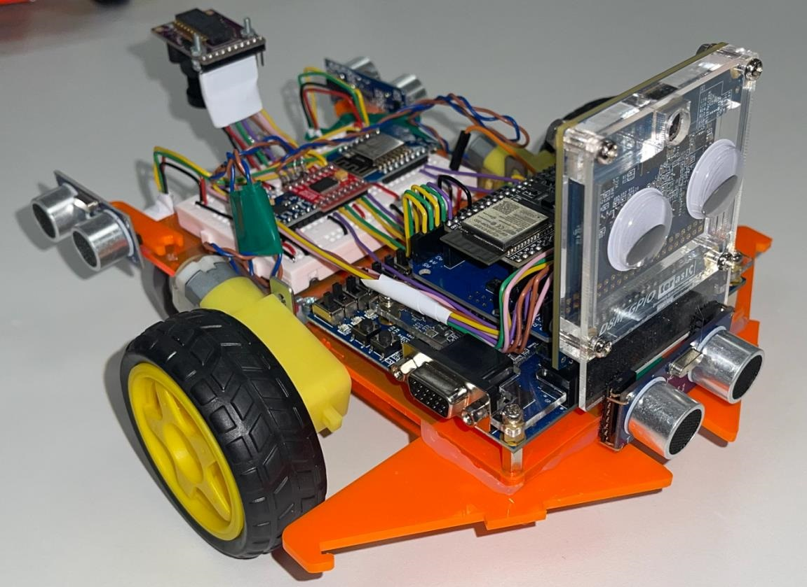
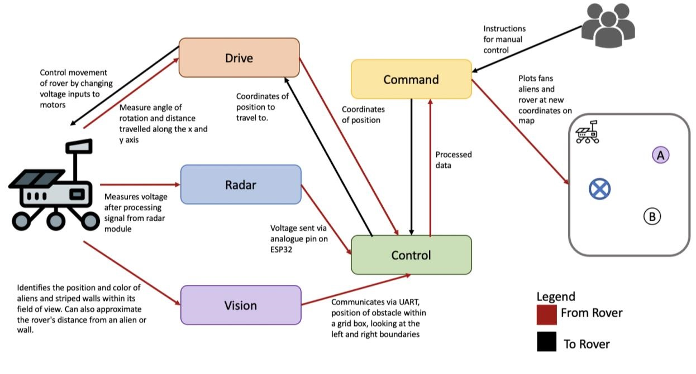
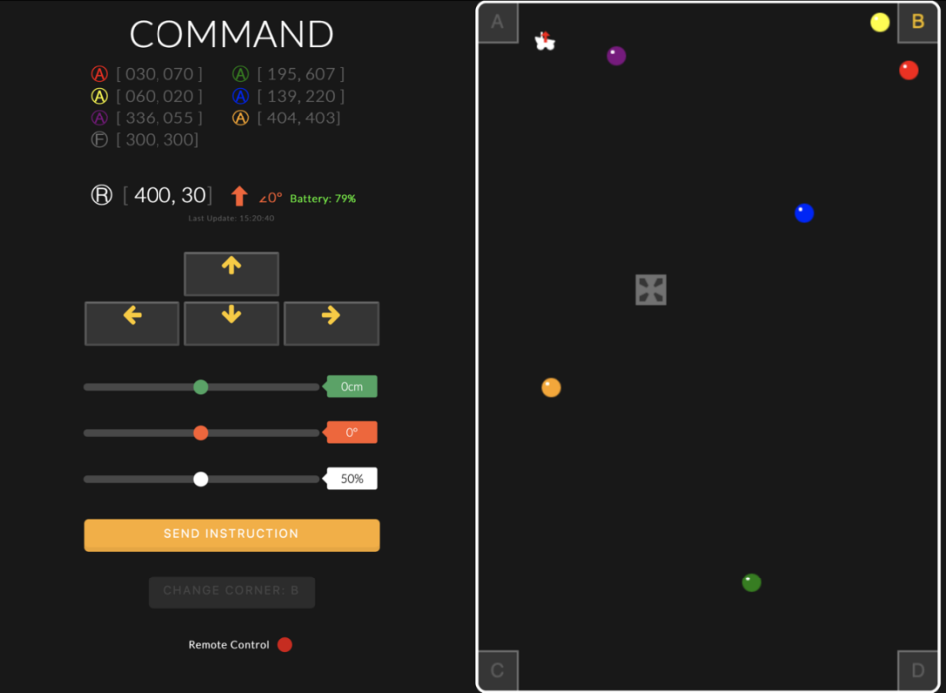
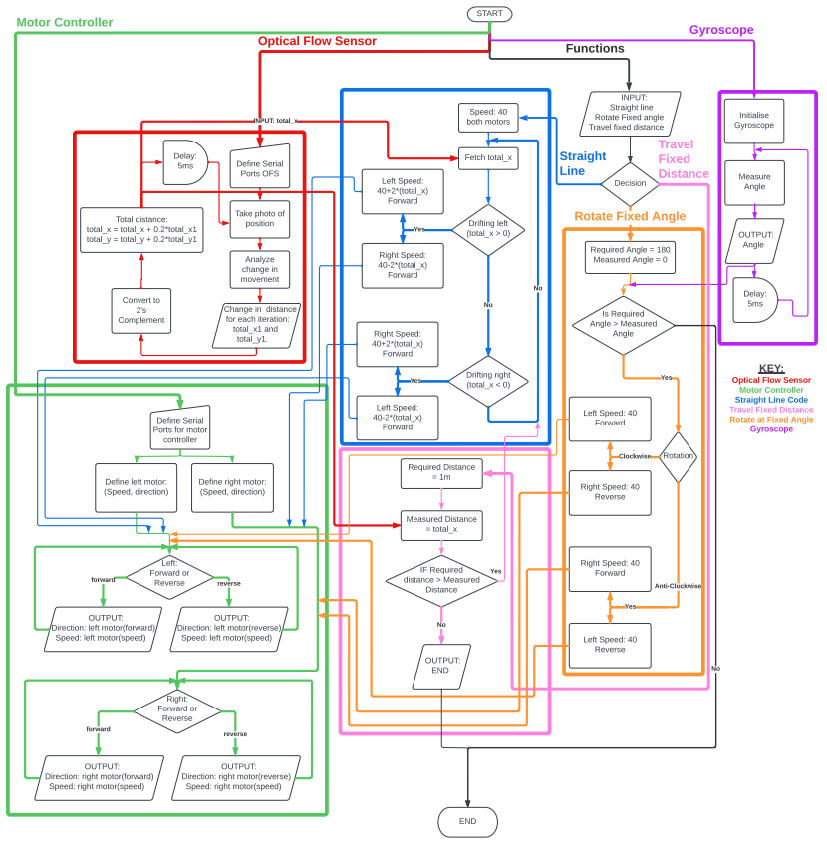

# Mars Rover

## Group Members
[Aishwarya Anand](https://github.com/aa2620)  
[Ifte Chowdury](https://github.com/ifte-c)  
[Gian-Luca Fenocchi](https://github.com/spacebod)  
Kristina Filichenok  
Dilan Jayasena  
[Savraj Sian](https://github.com/SavrajSian)  
Arthika Sivathasan

  
  
  
In particular, I focused on designing the frontend webserver (part of the command subsystem), used to manually control the rover and plot its location on a map (using ReactJS). Upon completion, I assisted in the drive subsystem of the rover.

The aim of the project was to design and build a rover that can be either controlled manually, using a 
website or autonomously, through a self-guiding system (in some ways replicating one of the actual 
Mars rovers). The rover’s task is to navigate its way through an arena and build a map of the different 
objects it encounters. The rover was to be solar-powered, utilising the solar-panels provided. The 
project was split into six different key subsystems, five of which were required to make the rover 
move and detect aliens, buildings, and fans on the arena. The Power Module was to be a separate 
substation used to charge a battery for the rover.  
 
 
  
<em>Image of finalised rover</em>
 
 
As a team, we had to design and implement six subsystems to control the rover. These subsystems had 
to effectively communicate with the central controller in order to transmit data collected from the rover 
to the user and control the rover via inputs given by the user.
 
 

<em>Diagram of all the sub-systems</em>
 
 
# Command Sub-System
The client-side of the Command module has the job of visualising data sent by the rover through the 
backend NodeJS server. The web app aims to display a map that illustrates the position of the rover, 
aliens, obstacles, and fan. This map will have to be 
updated regularly to display accurate positions. 
Furthermore, where manual control of the rover is 
required, a message must be sent to the server, 
containing manual control data.
 
 
  
<em>Website for controlling the rover</em>
 
 
# Drive Sub-System
Here is a diagram representing the complete flow of the drive sub-system:  
 
 
  
 
 
